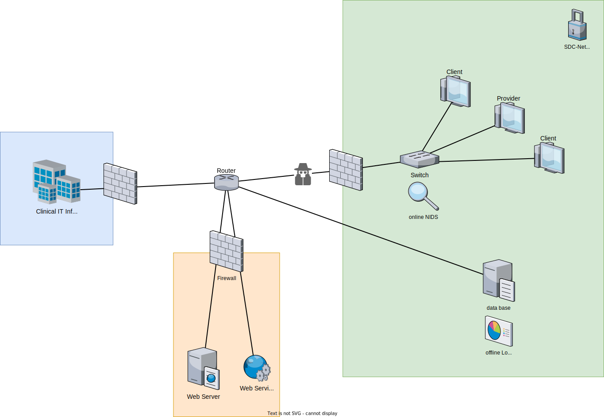
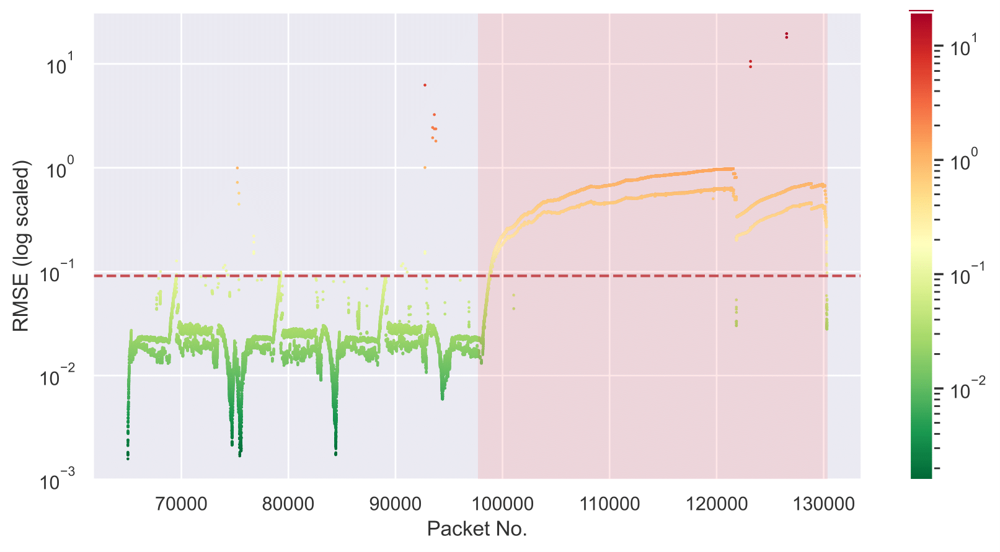
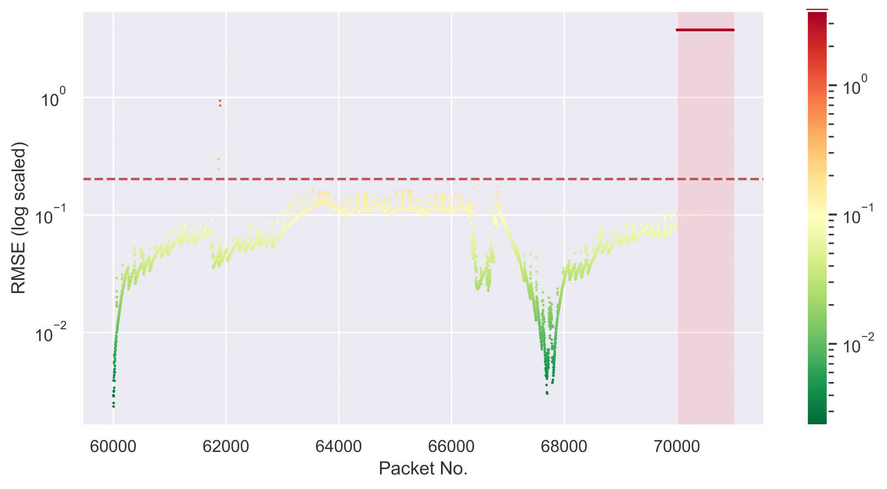

# Network Intrusion Detection System

With regard to the latest developments in the ISO/IEEE 11073 service-oriented device connectivity (SDC) its important to not leave possible security and safety risks of this new communication protocol out of consideration. Therefore the basic idea of this project (carried out during the author's bachelor thesis) was to improve the security as well as the safety of sdc connected medical devices with ML based anomaly detection. 
The concept is illustrated in the following chart: 

So the safety and security system is itemized in two anomaly detectors: one network intrusion detection system  (content of this repository) and one log/sensor anomaly detector. 
While the nids runs directly on the switch that interconnects different medical devices, the log anomaly detector runs in the backend. 

## Dependencies
The necessary dependencies are listed in `requirements.txt`: use `pip install -r requirements.txt` to install all suitable versions. 
Additionally wireshark or rather tshark has to be installed and added to the system path. 

## Underlying papers and informations

+ code is based on the [paper](https://arxiv.org/abs/1802.09089) and [implementation](https://github.com/ymirsky/Kitsune-py)
+ similiar project but blockchain based can be found [here](https://github.com/KevinTuncer/sdc-sniffer)
+ [Survey of Network Intrusion Detection Methods from the Perspective of the Knowledge Discovery in Databases Process](https://arxiv.org/abs/2001.09697)
+ [SOME/IP Intrusion Detection using Deep Learning-based Sequential Models in Automotive Ethernet Networks](https://arxiv.org/abs/2108.08262)
    + SOME/IP is automotive equivalente for service oriented communication
    + Recurrent Neural Network 
    + synthetical dataset generator
    + supervised learning, therefore not able to detect new unknown attacks 
+ [A Distributed Multi-Approach Intrusion Detection System for Web Services](https://dl.acm.org/doi/abs/10.1145/1854099.1854147)
    + static and dynamic anomaly detection (Hidden Markov Model)
    + lightway NIDS that works directly on web servers
    + system only inspects the payload (soap messages)
+ [A Method for Intrusion Detection in Web Services Based on Time Series](https://ieeexplore.ieee.org/document/7129383)
    + statistical model predicts the range of coming soap message sizes
    + if actual soap message size is out of this range its considered as an anomaly 
    + only one feature: soap message size 
+ [Federated Learning for Internet of Things: A Federated Learning Framework for On-device Anomaly Data Detection](https://arxiv.org/abs/2106.07976)
    + Deep Autoencoders
    + Framework to test it on a Raspberry Pi or Nvidia Jetson Nano
+ [An Intrusion Detection System for Internet of Medical Things](https://ieeexplore.ieee.org/document/9204697)
    + polynomal regression on physiological sensor data to predict next datapoints 
    + if actual sensor data highly deviates from the predicted one it gets considered as anomaly 
    + model gets executed in distributed manner
+ [On Generating Network Traffic Datasets with Synthetic Attacks for Intrusion Detection](https://arxiv.org/abs/1905.00304)
    + code can be found [here](https://github.com/tklab-tud/ID2T)
+ comparison of different packet crafting and sniffing libraries can be found [here](http://libtins.github.io/benchmark/)
    + faster alternative to pyshark: [Packet capture on Windows without a kernel driver](https://github.com/nospaceships/raw-socket-sniffer)
+ different open source implementations of the ISO/IEEE 11073 SDC
    + [c++ version](https://github.com/surgitaix/sdclib)
    + [python version](https://github.com/Draegerwerk/sdc11073)

## Usage steps 

**offline and online NIDS**

+ run `NIDS_offline.py` to train and execute the model on a dataset
+ run `NIDS_online.py` to train the model on a trainingset and execute it on live captured data
+ `Kitsune.py` specifies the training and execution structure of the model which is defined in `KitNET`

**Tuning hyperparameter** 

+ `hyperparaTune.py` is based on the library [hyperopt](https://github.com/hyperopt/hyperopt) which uses  Bayesian optimization 

**Adjusting features**

+ `FeatureExtractor.py`: uses scapy or tshark under the hood to extract meta data like srcIP, dstIP, etc. from the packets
+ `netStat.py`: uses the extracted meta data to calculate statistical features 
+ `AfterImage.py`: is used to calculate basic statistical features 

**Synthetical data generation** (`data_sdc11073`)

+ `fictEnvironments.py` initializes different clients and a provider (specified in `mdib_OPtable.xml`) as well as the communication between them
+ run `dataGen.py` to capture the data transmitted between clients and providers 
+ the saved file can be labeld in `dataLabeling.py` to evaluate the model later

## Results/Evaluation

**Root Mean Square Error and Threshold**

**Denial of Service Attack**

**Portscan Attack**

**Metrics, runtime and required resources**

| Metrics  | Denial of Service Attack | Portscan Attack |
| -------- | ------------------------ | --------------- |
| TPR      | 0.9952 | 0.9990 |
| FPR      | 0.0019 | 0.0004 |
| F-Score  | 0.9966 | 0.9975 |

+ runtime (on CPU): 469 Pakets/s
+ resources: 152 MB

For limitations and further improvements, see `TODO.txt`